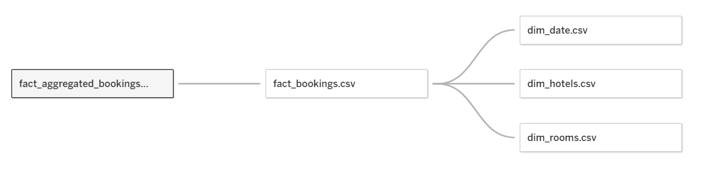

# Atliq_Hospitality
Link to [Dashboard](https://public.tableau.com/app/profile/y.nguyen4450/viz/Atliq_Hospitality_16877501089680/Dashboard1?publish=yes)

Link to [Challege](https://codebasics.io/challenge/codebasics-resume-project-challenge)

## Problem Statement
Atliq Grands sở hữu nhiều khách sạn 5 sao trên khắp Ấn Độ. Họ đã có kinh nghiệm 20 năm trong lĩnh vực quản lí khách sạn. Do các động thái từ đối thủ và sự quản lí không hiệu quả, Atliq Grands đang mất dần thị phần và doanh thu trong hạng mục khách sạn luxury/business đang bị giảm. Là một bước đi chiến lược, giám đốc điều hành của Atliq muốn kết hợp "Kinh doanh và dữ liệu thông minh" để lấy lại thị phần và phục hồi doanh thu.

Nhóm quản lí doanh thu đã quyết định thuê dịch vụ cung cấp bên thứ 3 để cung cấp thông tin chi tiết từ dữ liệu quá khứ của họ.

## Task List
- Tạo Dashboard
- Tìm Insight

## Dataset
Link to [Describe_Dataset](https://github.com/ynguyenntc/Atliq_Hospitality/blob/6b0c898ce8e48eb9e5c12a5ed9c34d961ef3da1c/Input%20Files/meta_data_hospitality.txt)

Dữ liệu được sử dụng là dữ liệu quá khứ của Atliq trong 3 tháng 5-7

Gồm 5 file .csv:
- dim_date.csv
- dim_hotels.csv
- dim_rooms.csv
- fact_bookings.csv
- fact_aggregated_bookings.csv

## Relationships

    

## Analyst View

    

## Some important insight
- Tỷ lệ Occupancy là  57.87% có nghĩa là có gần 32% doanh thu tiềm năng bị mất do phòng trống. Trong đó, những ngày trong tuần sẽ có tỉ lệ Occupancy thấp hơn những ngày cuối tuần. Có nghĩa là nhu cầu sử dụng khách sạn cho những ngày cuối tuần cao hơn, ta có thể tăng số lượng dịch vụ phù hợp. Còn những ngày trong tuần có thể đưa ra những chiến lược khuyến mãi để thu hút khách.

- Giá trị ADR(Doanh thu trung bình cho từng phòng được thuê) của những ngày trong tuần gần như tương đương những ngày cuối tuần trong khi Occupancy của cuối tuần lại cao hơn. Điều này có nghĩa là chiến lược giá phòng cho ngày bình thường và ngày cuối tuần hoặc lễ không hợp lí. Thông thường, giá phòng của những ngày cuối tuần nên là cao hơn.  Atliq nên tìm ra mức giá thích hợp để gia tăng doanh thu.